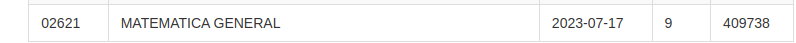
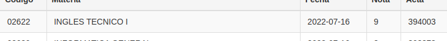

== Temario de la mentoria de MATEMATICA y GEOMETRIA

Este temario esta en construccion.
Sin embargo, los temas a dar corresponden a estas materias y examenes:

UNLaM, examen de ingreso al DPTO Ingenieria.
UNLaM, examenes 1 y 2 de matematica general de la tecnicatura en desarrollo web y apps moviles.

Tambien puede adjuntarse geometria, sin embargo esa materia no sera dada sin antes haber dado matematica.

Los temas de geometria a dar corresponden al examen de ingreso al DPTO Ingenieria de la UNLaM.

Adjuntamos las calificaciones obtenidas por Jose en esas materias, para que veas el rendimiento de su metodologia.

== Temario de INGLES

Este temario esta en construccion.
Sin embargo, los temas a dar corresponden a estas materias y examenes:

UNLaM, examenes 1 y 2 de ingles de la tecnicatura en desarrollo web y apps moviles.
Ademas se adjuntan algunos temas que tambien requiere el examen de Seminario en Produccion y Comprension de Textos.
  . Elementos sintacticos.
  . Morfologia.
  . Semantica.

